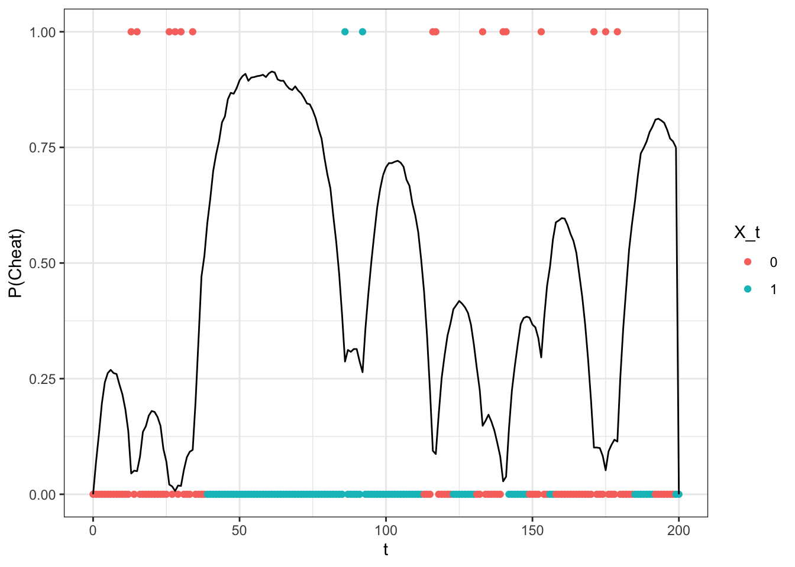

```{r setup, include=FALSE}
knitr::opts_chunk$set(echo = TRUE)
library(tidyverse)
```


```{r }
SampleCasino <- function(bigT){
  
  X_t <- c("Fair", rep(NA, bigT))
  
  for (j in 2:(bigT+1)) {
    if(X_t[j-1] == "Fair"){
      X_t[j] = sample(c("Fair", "Cheat"), 1, prob = c(0.95, 0.05))
    }else{
      X_t[j] = sample(c("Fair", "Cheat"), 1, prob = c(0.05, 0.95))
    }
    
  }
  
  Y_t <- sapply(X_t, function(x){
    if(x == "Fair"){
      return(sample(1:6, 1))
    }else{
      return(sample(1:6, 1, prob = c(49/250, 49/250, 49/250, 49/250, 49/250, 1/50)))
    }
  })
  
  return(data.frame(t = c(0:bigT),
                    X = X_t,
                    Y = Y_t))
  
}
set.seed(1234)
testSample <- SampleCasino(200)
```


## 1)

### a) Derive the forward  algorithms for computing

$$\alpha_t = P(X(t) \ | \ Y(0), \dots, Y(t))$$  


$\alpha_t = P(X(t)|Y(0), \dots ,Y(t)) = \frac{P(Y(0),\dots ,Y(t)|X(t))P(X(t))}{P(Y(0),\dots , Y(t))} = \frac{P(X(t), Y(0), \dots , Y(t))}{P(Y(0),\dots , Y(t))} =$

$\frac{p(Y(t)|X(t)) \sum_{X(t-1)} P(Y(0) \dots Y(t-1), X(t-1))P(X(t)|X(t-1))}{P(Y(0),\dots , Y(t))}$

Defining $c_n = P(Y(t) | Y(0), \dots Y(t-1))$, then 

$P(Y(0),\dots , Y(t)) = \prod_{m=1}^n c_m$

$P(Y(t) | Y(0), \dots Y(t-1)) \rightarrow P(Y(t) | X(t-1)) = g_1(Y(t))(\alpha_{t-1}M)_1 + g_2(Y(t))(\alpha_{t-1}M)_2$

That is, given $Y(0), \dots Y(t-1))$, we calculated $P(X(t-1))$ in the previous step. From there, we calculate the probability of being in each state $i$ with $M$, and then the probability of $Y(t)$ in each state, $g_i(Y(t))$

```{r }

Forward <- function(Y, theta){
  
  M <- theta[["M"]]
  G <- theta[["G"]]
  pi <- theta[["pi"]]
  
  alpha <- matrix(NA, nrow = length(Y), ncol = nrow(M))
  
  C  <- sum(pi * G[,Y[1]])
  
  alpha[1, ] = G[, Y[1] ] * t(pi) / C
  
  for (t in 2:nrow(testSample)) {
    c_n <- alpha[t-1, ] %*% M %*% G[,Y[t]]
    C <- c(C, c_n)
    alpha[t, ] <- G[,Y[t]] * (alpha[t-1, ] %*% M) / as.numeric(c_n)
  }
  
  return(cbind(alpha, C))
  
}


```


### b) Backwards


$\beta_t = P(Y(t+1), Y(t+2), \dots Y(T) | X(t)) = \sum_{i=1}^2 P(Y(t+1), Y(t+2), \dots, Y(T), X(t)=i | X(t-1)) =$

$\sum_{i=1}^2 P(Y(t+1) \dots Y(T)|X(t), X(t+1)) P(X_{t+1}|X(t)) = \sum_{i=1}^2 P(Y(t+1) \dots Y(T)|X(t+1)) P(X_{t+1}|X(t)) =$

$\sum_{i=1}^2 P(Y(t+2), \dots ,Y(T)|X(t+1))P(Y(t+1)|X(t+1))P(X(t+1)|X(t)) \rightarrow$

$\beta_t = \sum_{X(t+1)} \beta_{t+1}P(Y(t+1)|X(t+1))P(X(t+1)|X(t))$


```{r }

 
Backward = function(Y, theta, C){
  
  M <- theta[["M"]]
  G <- theta[["G"]]
  bigT = length(Y)
  m = nrow(M)
  beta = matrix(1, bigT, m)
  
  for(t in (bigT-1):1){
    tmp = as.matrix(beta[t+1, ] * G[, Y[t+1]])
    beta[t, ] = t(M %*% tmp) / C[t+1]
  }
  return(beta)
}


```


### C

```{r }

ForwardBackward <- function(Y, theta){
  
  alpha <- Forward(Y = Y, theta = theta)
  C <- alpha[,3]
  alpha = alpha[,1:2]
  beta <- Backward(Y = Y, theta = theta, C = C)
  
  return(alpha * beta)
  
}

M <- matrix(c(0.95, 0.05, 0.05, 0.95), nrow = 2)

G <- matrix(c(rep(1/6, 6), rep(49/250, 5), 1/50), nrow = 2, byrow = T)

pi <- matrix(c(1,0), nrow = 2)

theta <- list(M = M,
              G = G,
              pi = pi)

Y <- testSample$Y


probs <- ForwardBackward(Y = Y, theta = theta)

results <- data.frame(p_cheating = probs[,2],
                      Y_t = testSample$Y,
                      X_t = as.numeric(testSample$X == "Cheat"),
                      t = seq(0, 200))

results %>%
  mutate(is_6 = ifelse(Y_t == 6, 1, 0),
         X_t = as.factor(X_t)) %>%
  ggplot(aes(x = t)) +
  geom_point(aes(y = is_6, color = X_t)) +
  theme_bw() +
  geom_line(aes(y =  p_cheating)) +
  labs( y = "P(Cheat)")

```


Here the line represents the probabilty that the casino is cheating, the points indicate whether or not a 6 was rolled (1-5 is plotted at 0, 6 is plotted at 1), and the color of the point indicates whether or not the casino was cheating.

Here is the graph from HW8 for comparison. We see that they are very similar, but also that the Forward-Backward algorithm worked better to capture the cheating at the end boundary

```{r, out.width = "400px", out.height="250px"}

```

## 2

Consider the continuous state Markov chain $X(t+1) = r X(t) + \mathcal{N}(0, \sigma^2)$.  Assume $X(0) =x_0 \in \mathbb{R}$.

### a)
* Explain why $X(t)$ is always normally distributed.  Then compute the mean and variance of $X(t)$. (Hint:  you can express the mean and variances of $X(t)$ in terms of the mean and variances of $X(t-1)$.

Given $X(0) = x_0$, then $X(1) = r x_0 + \mathcal{N}(0, \sigma^2) = \mathcal{N}(r x_0, \sigma^2)$

Suppose we know $X(t-1)$. Then $X(t) = r X(t-1) + \mathcal{N}(0, \sigma^2) = \mathcal{N}(r X(t-1), \sigma^2)$

So $X(t)$ is always normally distributed with $\mu = rX(T-1)$ and $\sigma^2 = \sigma^2$


Furthermore, we can say that $\mu_t = r^tx_0$

$E[X(2)] = rX(1) + \mathcal{N}(0, \sigma^2) = E[r( r x_0 + \mathcal{N}(0, \sigma^2)) + \mathcal{N}(0, \sigma^2)] = E[r^2x_0 + r \mathcal{N}(0, \sigma^2)) + \mathcal{N}(0, \sigma^2))] = r^2x_0$

Now suppose $E[X(t-1)] = r^{t-1}x_0$. Then $E[X(t)] = E[rX(t-1) + \mathcal{N}(0, \sigma^2))] = E[rX(t-1)] + E[\mathcal{N}(0, \sigma^2))] = rE[X(t-1)] = r^tx_0$

$Var[X(1)] = Var[rx_0 + \mathcal{N}(0, \sigma^2)] = Var[rx_0] + Var[\mathcal{N}(0, \sigma^2)] = 0 + \sigma^2 = \sigma^2$

$Var[X(2)] = Var[rX(1) + \mathcal{N}(0, \sigma^2)] = Var[rX(1)] + Var[\mathcal{N}(0, \sigma^2)] = r^2Var[X(1)] + \sigma^2 = r^2\sigma^2+ \sigma^2$

In general, $Var[X(t)] = \sum_{i=0}^{t-1}r^{2i}\sigma^2$, if we are charting the distribution at time $t=0$. If we are at time $t$ and want the variance, then it is simply $\sigma^2$


$X(t) \sim \mathcal{N}(r^tx_0, \sum_{i=0}^{t-1}r^{2i}\sigma^2))$ at $t_0$ OR

$X(t) \sim \mathcal{N}(rX(t-1), \sigma^2))$ if we are at $t-1$


### b)
Using a), determine the distribution $\pi = \lim_{t \to \infty} X(t)$.  Write down the kernel $K(s_0, s_1) = P(X(1) = s_1 \ | \ X(0) = s_0)$ and show,


$$\int_{-\infty}^\infty K(s_0, s_1) \pi(s_0) ds_0 = \pi(s_1)$$


In words, $\pi$ is the stationary distribution of $X(t)$.  


$\pi = \lim_{t \to \infty} X(t) = \lim_{t \to \infty} X(t) \sim \mathcal{N}(r^tx_0, \sum_{i=0}^{t-1}r^{2i}\sigma^2))$

If $0 <r < 1$, then the distribution converges to a mean of 0
If $r = 1$, then the mean is $x_0$
If $r > 1$, then the distribution diverges and goes to infinity

$K(s_0, s_1) = \frac{1}{\sqrt{2\pi\sigma^2}}e^{-(s_1-rs_0) / (2\sigma^2)}$

Since we know $X(0) = x_0$, $\pi(s_0)=1$

$\int_{-\infty}^\infty K(s_0, s_1) \pi(s_0) ds_0 = \int_{-\infty}^{\infty} \frac{1}{\sqrt{2\pi\sigma^2}}e^{-(s_1-rs_0) / (2\sigma^2)}\pi(s_0)ds_0 = \int_{-\infty}^{\infty} \frac{1}{\sqrt{2\pi\sigma^2}}e^{-(s_1-rs_0) / (2\sigma^2)}ds_0 = \mathcal{N}(rs_0, \sigma^2) = rs_0 + \mathcal{N}(0,\sigma^2) = rx_0 + \mathcal{N}(0,\sigma^2)$


### a) In the SNE paper, equation (4) gives the loss function the authors are trying to optimize.   They call it a cost function.   Explain the authors' motivations in using this cost function.   What are the variables in the cost function?  In other words, what are we optimizing?  


The cost function the authors use is a Kullback-Leibler divergence. The variables are $p_{ij}$ and $q_{ij}$, the distances between points in the original space and in the reduced dimensions. They justify using the function because it works to not just keep nearby points close together, but also keeps far away points apart


### b) Derive equation (5) which gives a formula for the gradient of the cost function. As a start, you may want to assume that we are reducing to a single dimension, making each $y$ a scalar, but then make sure to generalize to any dimension.


Equation 5: $$\frac{\partial C}{\partial y_i} = 2 \sum_j (y_i - y_j)(p_{ij} - q_{ij} + p_{ji} - q_{ji})$$

$$C = \sum_i \sum_j p_{ij} \log \frac{p_{ij}}{q_{ij}} = \sum_{i,j, i \neq j}p_{ij} \log(p_{ij}) - \sum_{i,j, i \neq j}p_{ij} \log(q_{ij})$$

Since $p_ij$ are fixed constants, we only work to minimize the last term. So rewrite as 

$$C = - \sum_{i,j, i \neq j}p_{ij} \log(q_{ij})$$

Take partial derivative wrt $\mathbf{y_\ell}$, split into three cases: $\ell \neq i, j$, $j=\ell$, $i=\ell$

$$\frac{\partial C}{\partial y_\ell} 
= - \frac{\partial}{\partial y_\ell} \left[\sum_{i,j;i \ne j;i,j \ne \ell} p_{ij} \log(q_{ij}) + \sum_{i,i \ne \ell} p_{i\ell} \log(q_{i\ell}) + \sum_{j,j \ne \ell} p_{\ell j} \log(q_{\ell j}) \right] =$$

$$\frac{\partial C}{\partial y_\ell} = - \left[\sum_{i,j;i \ne j;i,j \ne \ell} p_{ij} \frac{\frac{\partial}{\partial y_\ell} q_{ij}}{q_{ij}}+ \sum_{i,i \ne \ell} p_{i\ell} \frac{\frac{\partial}{\partial y_\ell} q_{i \ell}}{q_{i \ell}})+ \sum_{j,j \ne \ell} p_{\ell j} \frac{\frac{\partial}{\partial y_\ell} q_{\ell j}}{q_{\ell j}}) \right]$$

which follows from $\frac{\partial C}{\partial y_\ell} \log(q_{ij}) = \frac{\frac{\partial C}{\partial y_\ell} q_{ij}}{q_{ij}}$

recall: $q_{ij} = \frac{\exp(-||\mathbf{y_i} - \mathbf{y_j}||^2)}{\sum_{k \neq i}\exp(-||\mathbf{y_i} - \mathbf{y_k}||^2)}$

Also note: $||\mathbf{y_\ell} - \mathbf{y_i}||^2 = \sum(\mathbf{y_\ell} - \mathbf{y_i})$

And: $\frac{\partial}{\partial x} \exp(-||x-y||^2) = -2(x-y)\exp(-||x-y||^2)$

assume $i,j \neq \ell$:

$\frac{\partial q_{ij}}{\partial y_\ell} = \frac{\partial}{\partial\mathbf{y_i}}\frac{\exp(||\mathbf{y_i} - \mathbf{y_j}||^2)}{\sum_{k \neq i}\exp(||\mathbf{y_i} - \mathbf{y_k}||^2)} = \exp(-||y_i - y_j||^2) \frac{\partial}{\partial \mathbf{y_\ell}} \frac{1}{\sum_k \exp(-||y_i - y_k||^2)} =$

$\exp(-||y_i - y_j||^2)(-1)\left(\frac{1}{\sum_k \exp(-||y_i - y_k||^2)} \right)^2 \frac{\partial}{\partial y_\ell} \sum_k \exp(-||y_i - y_k||^2) =$

$\exp(-||y_i - y_j||^2)(-1)\left(\frac{1}{\sum_k \exp(-||y_i - y_k||^2)} \right)^2 \cdot (2)(y_i - y_\ell)\exp(-(||y_i - y_\ell||^2)) =$

$-2(y_i - y_\ell) \frac{\exp(-||y_i - y_j||^2)}{\sum_k \exp(-||y_i - y_k||^2)} \frac{\exp(-||y_i - y_j||^2)}{\sum_k \exp(-||y_i - y_k||^2)} =$

$-2(y_i - y_\ell)q_{ij}q_{j\ell}$


Now consider $i = \ell$ and $j \neq \ell$

$\frac{\partial}{\partial y_\ell} q_{\ell j} = \frac{\partial}{\partial y_\ell} \frac{\exp(-||y_\ell - y_j||^2)}{\sum_{k \neq \ell} \exp(-||y_{\ell} - y_k||^2)} = -2(y_\ell - y_j)q_{\ell j} + q_{\ell j} \sum_{k \neq \ell}2(y_\ell - y_k)q_{\ell k}$


Next, consider $j = \ell$, $i \neq \ell$

$\frac{\partial}{\partial y_\ell} q_{i \ell} = \frac{\partial}{\partial y_\ell} \frac{\exp(-||y_i - y_\ell||^2)}{\sum_{k \neq i} \exp(-||y_i - y_k||^2)} = 2(y_i - y_\ell)q_{i\ell} - 2(y_i - y_\ell)q^2_{i\ell}$


Plug back in:

$$\sum_{i,j,i \neq j, i,j \neq \ell} p_{ij} \frac{\partial/\partial y_\ell q_{ij}}{q_{ij}} = \sum_{i,j,i \neq j, i,j \neq \ell} p_{ij} (-2)(y_i - y_\ell)q_{i \ell} = -2 \sum_{i, i \neq \ell}(y_i - y_\ell)q_{i\ell} + 2 \sum_{i, i \neq \ell}(y_i - y_\ell)q_{i\ell}p_{i\ell}$$

$$\sum_{i, i \neq \ell} p_{i \ell} \frac{\partial / \partial y_\ell q_{i \ell}}{q_{i \ell}} = \sum_{i, i \neq \ell} p_{i \ell} \frac{2(y_i - y_\ell)q_{i \ell} - 2(y_i - y_\ell)q^2_{i \ell}}{q_{i\ell}} = 2\sum_{i, i \neq \ell}(y_i - y_\ell)p_{i \ell} - 2 \sum_{i, i \neq \ell}(y_i - y_\ell)p_{i \ell}q_{i \ell}$$


for $i = \ell$.  
\begin{align}
\sum_{j,j \ne \ell} p_{\ell j} 
\frac{\frac{\partial}{\partial y_\ell} q_{\ell j}}{q_{\ell j}}
& = 
\sum_{j,j \ne \ell} p_{\ell j} 
\frac{-2(y_\ell - y_j) q_{\ell j}
+ q_{\ell j} \sum_{k \ne \ell} 2(y_\ell - y_k) q_{\ell k}}{q_{\ell j}}
\\ \notag
& = 
-2 \sum_{j,j \ne \ell} p_{\ell j} 
(y_\ell - y_j) 
+
\sum_{j,j \ne \ell} p_{\ell j} 
\sum_{k \ne \ell} 2(y_\ell - y_k) q_{\ell k}
\\ \notag
& = 
-2 \sum_{j,j \ne \ell} p_{\ell j} 
(y_\ell - y_j) 
+
2 \sum_{k \ne \ell} (y_\ell - y_k) q_{\ell k},
\end{align}
where the last step follows from $\sum_{j,j \ne \ell} p_{\ell j} = 1$


Putting together:

\begin{align}
\frac{\partial C}{\partial y_\ell} 
= - \bigg[ &
\big(
-2  \sum_{i;i \ne \ell}  (y_i - y_\ell) q_{i \ell}
+ 2 \sum_{i;i \ne \ell}  (y_i - y_\ell) q_{i \ell} p_{i \ell}
\big)
\\ \notag 
& + 
\big(
2 \sum_{i,i \ne \ell} (y_i - y_\ell) p_{i \ell} 
- 2 \sum_{i,i \ne \ell} (y_i - y_\ell) p_{i\ell} q_{i \ell} 
\big)
\\ \notag
& + 
\big(-2 \sum_{j,j \ne \ell} p_{\ell j} 
(y_\ell - y_j) 
+
2 \sum_{k \ne \ell} (y_\ell - y_k) q_{\ell k}
\big)
\bigg]
\end{align}


The third and fifth ones cancel:


$$\frac{\partial C}{\partial y_\ell} = - \bigg[-2  \sum_{i;i \ne \ell}  (y_i - y_\ell) q_{i \ell}+ 2 \sum_{i,i \ne \ell} (y_i - y_\ell) p_{i \ell} - 2 \sum_{j,j \ne \ell} p_{\ell j} (y_\ell - y_j) +2 \sum_{k \ne \ell} (y_\ell - y_k) q_{\ell k}\bigg]$$


Change index names $i,k$ to $j$:

\begin{align}
\frac{\partial C}{\partial y_\ell} 
&= 2  \sum_{j;j \ne \ell}  (y_j - y_\ell) q_{i \ell}
- (y_j - y_\ell) p_{j \ell} 
+  (y_\ell - y_j) p_{\ell j} 
- (y_\ell - y_j) q_{\ell j}
\\ \notag
& = 2  \sum_{j;j \ne \ell}  (y_\ell - y_j) (-q_{i \ell}
+ p_{i \ell} + p_{\ell i} - q_{\ell i})
\end{align}


### c) Write R functions to compute the cost function and the gradient of the cost functions given data points $x$ and the dimensional reduced points $y$.  


Some general code to lay thing out:

```{r message=FALSE}

diffusion_maps <- read_csv("diffusion_maps_data.csv")

X <- diffusion_maps[-11]

sigma <- 1

distance_matrix <- dist(X) %>% as.matrix()
distance_matrix <- distance_matrix^2 / (2 * sigma)


P <- t(sapply(1:nrow(X), function(i){
  Di <- distance_matrix[i, ]
  P_i <- exp(-Di)
  sumP_i <- sum(P_i[-i])
  P_i <- P_i / sumP_i
  P_i[i] = 0
  
  return(P_i)
  
}))

Y <- data.frame(x1 = rnorm(n = nrow(X)),
                x2 = rnorm(n = nrow(X)))

y_dist <- dist(Y) %>% as.matrix()

Q <- t(sapply(1:nrow(X), function(i){
  Di <- y_dist[i, ]
  Q_i <- exp(-Di^2)
  sumQ_i <- sum(Q_i[-i])
  Q_i <- Q_i / sumQ_i
  Q_i[i] = 0
  
  return(Q_i)
  
}))

Cost =  0
for (i in 1:nrow(X)) {
  J = c(1:nrow(X))
  J <- J[-i]
  for(j in J){
    Cost = Cost + (P[i,j] * log(P[i,j] / Q[i,j]))
  }
}

gradient <- matrix(data = 0, nrow = nrow(Y), ncol = ncol(Y))
for(i in 1:nrow(Y)){
  Yi <- Y[i,] %>% as.numeric()
  Y_diff <- apply(Y, 1, function(x){x - Yi}) %>% t()
  out <- colSums(Y_diff * (P[i, ] - Q[i, ] + P[,i] - Q[, i]))
  gradient[i, ] = out
  
}
```


Gradient function, `Gradient(Y)`:

```{r }

Gradient <- function(Y){
  
  y_dist <- dist(Y) %>% as.matrix()
  
  Q <- t(sapply(1:nrow(X), function(i){
    Di <- y_dist[i, ]
    Q_i <- exp(-Di^2)
    sumQ_i <- sum(Q_i[-i])
    Q_i <- Q_i / sumQ_i
    Q_i[i] = 0
    
    return(Q_i)
    
  }))
  
  gradient <- matrix(data = 0, nrow = nrow(Y), ncol = ncol(Y))
  
  for(i in 1:nrow(Y)){
    if(ncol(Y) > 1){
      Yi <- Y[i,] %>% as.numeric()
    }else{
        Yi <- Y
        }
    Y_diff <- apply(Y, 1, function(x){x - Yi}) %>% t()
    if(ncol(Y) == 1){
      out <- sum(Y_diff * (P[i, ] - Q[i, ] + P[,i] - Q[, i]))
    }else{
      out <- colSums(Y_diff * (P[i, ] - Q[i, ] + P[,i] - Q[, i]))
    }
    if(ncol(Y) == 1){
      gradient[i] = 2*out
    }else{
        gradient[i, ] = 2*out
        }
    
    
  }
  
  return(gradient)
}
```


Given that $P$ and $Q$ have already been calculated, solve for $Cost$

`Cost(P,Q)`

```{r }
Cost <- function(P,Q){

cost =  0
for (i in 1:nrow(P)) {
  J = c(1:nrow(P))
  J <- J[-i]
  for(j in J){
    cost = cost + (P[i,j] * log(P[i,j] / Q[i,j]))
  }
}
return(cost)
}


```


### d) Using steepest descent, compute SNE to dimensionally reduce the dataset of hw $8$, problem $2$ to $1$ and $2$ dimensions.  Plot the 1-d and 2-d reductions produced by SNE and compare to your results in hw $8$.  


```{r }

norm <- function(x){
  return(
    sqrt(
      sum(x^2)
    )
  )
}

SNE <- function(X, dimension, epsilon = 1e-3, max_iter = 1000, print_every = 50){
  
  sigma <- 1
  
  N <- nrow(X)
  
  distance_matrix <- dist(X) %>% as.matrix()
  distance_matrix <- distance_matrix^2 / (2 * sigma)
  
  
  P <- t(sapply(1:N, function(i){
    Di <- distance_matrix[i, ]
    P_i <- exp(-Di)
    sumP_i <- sum(P_i[-i])
    P_i <- P_i / sumP_i
    P_i[i] = 0
    
    return(P_i)
    
  }))
  
  Y <- matrix(rnorm(n = N*dimension), ncol = dimension)
  
  y_dist <- dist(Y) %>% as.matrix()
  
  Q <- t(sapply(1:N, function(i){
    Di <- y_dist[i, ]
    Q_i <- exp(-Di^2)
    sumQ_i <- sum(Q_i[-i])
    Q_i <- Q_i / sumQ_i
    Q_i[i] = 0
    
    return(Q_i)
    
  }))
  
  grad <- Gradient(Y)
  
  iteration = 1
  cost <- Cost(P,Q)
  s <- 1
  
  while(iteration < max_iter & cost > epsilon){
    if(iteration %% print_every == 0){
      print(glue::glue("Iteration: {iteration}. Total Cost: {cost}"))
    }
    
    grad <- Gradient(Y)
    
    ng <- apply(grad, 2, function(x){
      return(x / norm(x))
    })
    
    Y <- Y + s * ng
     y_dist <- dist(Y) %>% as.matrix()
  
  Q <- t(sapply(1:N, function(i){
    Di <- y_dist[i, ]
    Q_i <- exp(-Di^2)
    sumQ_i <- sum(Q_i[-i])
    Q_i <- Q_i / sumQ_i
    Q_i[i] = 0
    
    return(Q_i)
    
  }))
  
  Y = sweep(Y,2,apply(Y,2,mean)) ## center Y
  
  iteration <- iteration + 1
  cost <- Cost(P,Q)
    
  }
  
  return(Y)
  
}

set.seed(123)
reducedDimensions2 <- SNE(X, 2, max_iter = 500)


checkOutput <- data.frame(beta = diffusion_maps$beta,
                          x1 = reducedDimensions2[,1],
                          x2 = reducedDimensions2[,2])

ggplot(data = checkOutput) +
  geom_point(aes(x = x1, y = x2, color = beta)) +
  theme_bw()


set.seed(123)
reducedDimensions1 <- SNE(X, 1, max_iter = 50, print_every = 10)
checkOutput <- data.frame(beta = diffusion_maps$beta,
                          x1 = reducedDimensions1)

ggplot(data = checkOutput) +
  geom_point(aes(x = x1, y = 0, color = beta)) +
  theme_bw()

```


And we are able to recover the underlying manifold very well with the SNE algorithm in 2-d. For some reason it doesn't quite work when the dimension for $Y$ is 1. I think it has to do with how I've vectorized it to speed things up, but when Y is a column there's issues with it being treated as a numeric. But in 2+ dimensions the function separates the data extremely well, showing a good 2-d representation of the underlying data structure.


"Bonus"

While trying to troubleshoot and do some extra research on the topic, I did find some nice code for t-SNE. It utilizes the search method for $\sigma^2$ for each $P_i$, and the momentum aspect of the gradient. It is also much faster than the code I wrote


```{r }

tsne <- function(X, initial_config = NULL, k=2, initial_dims=30, perplexity=30, max_iter = 1000, min_cost=0, epoch_callback=NULL,epoch=100 ){
  
  .Hbeta <- function(D, beta){
	P = exp(-D * beta)
	sumP = sum(P)
	if (sumP == 0){
		H = 0
		P = D * 0
	} else {
		H = log(sumP) + beta * sum(D %*% P) /sumP
		P = P/sumP
	}
	r = {}
	r$H = H
	r$P = P
	r
}

.x2p <- function(X,perplexity = 15,tol = 1e-5){
	if (class(X) == 'dist') {
		D = X
		n = attr(D,'Size')
	} else{
		D = dist(X)
		n = attr(D,'Size')
	}

	D = as.matrix(D)
	P = matrix(0, n, n )		
	beta = rep(1, n)
	logU = log(perplexity)
	
	for (i in 1:n){
		betamin = -Inf
		betamax = Inf
		Di = D[i, -i]
		hbeta = .Hbeta(Di, beta[i])
		H = hbeta$H; 
		thisP = hbeta$P
		Hdiff = H - logU;
		tries = 0;

		while(abs(Hdiff) > tol && tries < 50){
			if (Hdiff > 0){
				betamin = beta[i]
				if (is.infinite(betamax)) beta[i] = beta[i] * 2
				else beta[i] = (beta[i] + betamax)/2
			} else{
				betamax = beta[i]
				if (is.infinite(betamin))  beta[i] = beta[i]/ 2
				else beta[i] = ( beta[i] + betamin) / 2
			}
			
			hbeta = .Hbeta(Di, beta[i])
			H = hbeta$H
			thisP = hbeta$P
			Hdiff = H - logU
			tries = tries + 1
		}	
			P[i,-i]  = thisP	
	}	
	
	r = {}
	r$P = P
	r$beta = beta
	sigma = sqrt(1/beta)
	
	message('sigma summary: ', paste(names(summary(sigma)),':',summary(sigma),'|',collapse=''))

	r 
}

	if ('dist' %in% class(X)) {
		n = attr(X,'Size')
		}
	else 	{
		X = as.matrix(X)
		X = X - min(X)
		X = X/max(X)
		initial_dims = min(initial_dims,ncol(X))
		n = nrow(X)
	}

	momentum = .5
	final_momentum = .8
	mom_switch_iter = 250

	epsilon = 500
	min_gain = .01
	initial_P_gain = 4

	eps = 2^(-52) # typical machine precision

	if (!is.null(initial_config) && is.matrix(initial_config)) {
		if (nrow(initial_config) != n | ncol(initial_config) != k){
			stop('initial_config argument does not match necessary configuration for X')
		}
		ydata = initial_config
		initial_P_gain = 1

	} else {
		ydata = matrix(rnorm(k * n),n)
	}

	P = .x2p(X,perplexity, 1e-5)$P
	P = .5 * (P + t(P))

	P[P < eps]<-eps
	P = P/sum(P)

	P = P * initial_P_gain
	grads =  matrix(0,nrow(ydata),ncol(ydata))
	incs =  matrix(0,nrow(ydata),ncol(ydata))
	gains = matrix(1,nrow(ydata),ncol(ydata))

	for (iter in 1:max_iter){
		if (iter %% epoch == 0) { # epoch
			cost =  sum(apply(P * log((P+eps)/(Q+eps)),1,sum))
			message("Epoch: Iteration #",iter," error is: ",cost)
			if (cost < min_cost) break
			if (!is.null(epoch_callback)) epoch_callback(ydata)

		}

		sum_ydata = apply(ydata^2, 1, sum)
		num =  1/(1 + sum_ydata +    sweep(-2 * ydata %*% t(ydata),2, -t(sum_ydata)))
		diag(num)=0
		Q = num / sum(num)
		if (any(is.nan(num))) message ('NaN in grad. descent')
		Q[Q < eps] = eps
		stiffnesses = 4 * (P-Q) * num
		sum_stiffness = colSums(stiffnesses)
		for (i in 1:n){
			stiffnesses[i, i] = stiffnesses[i, i] - sum_stiffness[i]
		}
		grads = -4 * (stiffnesses %*% ydata)
		gains = ((gains + .2) * abs(sign(grads) != sign(incs)) +
				 gains * .8 * abs(sign(grads) == sign(incs)))

		gains[gains < min_gain] = min_gain

		incs = momentum * incs - epsilon * (gains * grads)
		ydata = ydata + incs
		ydata = sweep(ydata,2,apply(ydata,2,mean))
		if (iter == mom_switch_iter) momentum = final_momentum

		if (iter == 100 && is.null(initial_config)) P = P/4

	}
	return(ydata)
}


set.seed(123)
tSNE_output <- tsne(X = X, k = 2)

checkOutput <- data.frame(beta = diffusion_maps$beta,
                          x1 = tSNE_output[,1],
                          x2 = tSNE_output[,2])

ggplot(data = checkOutput) +
  geom_point(aes(x = x1, y = x2, color = beta)) +
  theme_bw()

```


```{r eval = FALSE, echo = FALSE}


Y <- testSample$Y

M <- matrix(c(0.95, 0.05, 0.05, 0.95), nrow = 2)

G <- matrix(c(rep(1/6, 6), rep(49/250, 5), 1/50), nrow = 2, byrow = T)

pi <- matrix(c(1,0), nrow = 2)

alpha <- matrix(NA, nrow = nrow(testSample), ncol = 2)

C  <- sum(pi * G[,Y[1]])

alpha[1, ] = G[, Y[1] ] * t(pi) / C

for (t in 2:nrow(testSample)) {
  c_n <- alpha[t-1, ] %*% M %*% G[,Y[t]]
  C <- c(C, c_n)
  alpha[t, ] <- G[,Y[t]] * (alpha[t-1, ] %*% M) / as.numeric(c_n)
  # alpha[t, ] <- G[,Y[t]] * (alpha[t-1, ] %*% M)
  # c_n <- sum(alpha[t, ])
  # alpha[t, ] <- alpha[t, ] / c_n
  # C <- c(C,c_n)
  
}


# Backward <- function(Y, theta, C){
#   G <- theta[["G"]]
#   M <- theta[["M"]]
#   
#   beta <- matrix(NA, nrow = length(Y), ncol = 2)
#   
#   bigT <- length(Y)
#   
#   beta[bigT, ] = 1
#   
#   for(t in (bigT-1):1){
#     beta[t, 1] = (beta[t+1, 1] * M[1,1] * G[1, Y[t+1]] + beta[t+1, 2] * M[1,2] * G[2, Y[t+1]]) / C[t+1]
#     beta[t, 2] = (beta[t+1, 1] * M[2,1] * G[1, Y[t+1]] + beta[t+1, 2] * M[2,2] * G[2, Y[t+1]]) / C[t+1]
#     #beta[t, ] = rowSums(beta[t+1, ] * G[, Y[t+1]] * M) #/ C[t+1]
#   }
#   
#   return(beta)
# }


Gradient(Y){
  
  stiffnesses = 4 * (P-Q) * num
  sum_stiffness = colSums(stiffnesses)
  for (i in 1:n){
    stiffnesses[i, i] = stiffnesses[i, i] - sum_stiffness[i]
  }
  grads = -4 * (stiffnesses %*% Y)
  
}

tsne <- function(X, initial_config = NULL, k=2, initial_dims=30, perplexity=30, max_iter = 1000, min_cost=0, epoch_callback=NULL, epoch=100 ){

		X = as.matrix(X)
		initial_dims = min(initial_dims,ncol(X))
		
		n = nrow(X)

	momentum = .5
	final_momentum = .8
	mom_switch_iter = 250

	epsilon = 500
	initial_P_gain = 4

	eps = 2^(-52) # typical machine precision


	Y = matrix(rnorm(k * n),n)


	P = .x2p(X,perplexity, 1e-5)$P
	P = .5 * (P + t(P))

	P[P < eps]<-eps
	P = P/sum(P)

	P = P * initial_P_gain ## Make P larger at start to speed things up
	
	grads =  matrix(0,nrow(Y), ncol(Y))
	
	incs =  matrix(0,nrow(Y), ncol(Y))
	
	gains = matrix(1,nrow(Y), ncol(Y))
	
	iter <- 1
cost =  1000
	while (iter < max_iter & cost > min_cost){
	  
		if (iter %% epoch == 0) { # Print cost every epoch iteration
			cost =  sum(apply(P * log((P)/(Q)),1,sum))
			message("Epoch: Iteration #",iter," error is: ",cost)
			if (!is.null(epoch_callback)) epoch_callback(Y)

		}

		sum_Y = apply(Y^2, 1, sum)
		
		q_intermediate =  1/(1 + sum_Y + sweep(-2 * Y %*% t(Y), 2, -t(sum_Y)))
		
		diag(q_intermediate)=0
		
		Q = q_intermediate / sum(q_intermediate)
		
		Q[Q < eps] = eps
		
		stiffnesses = 4 * (P-Q) * q_intermediate
		sum_stiffness = colSums(stiffnesses)
		
		for (i in 1:n){
			stiffnesses[i, i] = stiffnesses[i, i] - sum_stiffness[i]
		}
		
		grads = -4 * (stiffnesses %*% Y)
		
		gains = (gains + .2) * abs(sign(grads) != sign(incs)) +
				 gains * .8 * abs(sign(grads) == sign(incs))

		incs = momentum * incs - epsilon * (gains * grads)
		
		Y = Y + incs
		
		Y = sweep(Y,2,apply(Y,2,mean)) ## center Y
		
		if (iter == mom_switch_iter){ ### Increase momentum
		  momentum = final_momentum
		}

		if (iter == 100 && is.null(initial_config)){  ## reset P after 100 iterations
		  P = P/4
		}
		iter <- iter + 1
		cost =  sum(apply(P * log((P)/(Q)),1,sum))

	}
	return(Y)
}

.Hbeta <- function(D, beta){
	P = exp(-D * beta)
	sumP = sum(P)
	if (sumP == 0){
		H = 0
		P = D * 0
	} else {
		H = log(sumP) + beta * sum(D %*% P) /sumP
		P = P/sumP
	}
	r = {}
	r$H = H
	r$P = P
	r
}

.x2p <- function(X,perplexity = 15,tol = 1e-5){

	D = dist(X) ### create a matrix with distance between points
	D = as.matrix(D)
	n = nrow(D)
	P = matrix(0, n, n ) #Initialize P matrix		
	beta = rep(1, n)
	logU = log(perplexity)
	
	for (i in 1:n){
		betamin = -Inf
		betamax = Inf
		Di = D[i, -i] #subset the row for i, and remove i
		hbeta = .Hbeta(Di, beta[i])
		H = hbeta$H; 
		thisP = hbeta$P
		Hdiff = H - logU;
		tries = 0;

		while(abs(Hdiff) > tol && tries < 50){
			if (Hdiff > 0){
				betamin = beta[i]
				if (is.infinite(betamax)){ 
				  beta[i] = beta[i] * 2
				  }else {
				    beta[i] = (beta[i] + betamax)/2
				    }
			} else{
				betamax = beta[i]
				if (is.infinite(betamin)){  
				  beta[i] = beta[i]/ 2
				  }else beta[i] = ( beta[i] + betamin) / 2
			}
			
			hbeta = .Hbeta(Di, beta[i])
			H = hbeta$H
			thisP = hbeta$P
			Hdiff = H - logU
			tries = tries + 1
		}	
			P[i,-i]  = thisP	
	}	
	
	r = {}
	r$P = P
	r$beta = beta
	sigma = sqrt(1/beta)
	
	return(P) 
}

set.seed(1)
test <- tsne(X = X, min_cost = .13)

checkOutput <- data.frame(beta = diffusion_maps$beta,
                          x1 = test[,1],
                          x2 = test[,2])

ggplot(data = checkOutput) +
  geom_point(aes(x = x1, y = x2, color = beta)) +
  theme_bw()


```


```{r echo=F, eval = F}


distance <- function(x, y){
  return(norm(x-y))
}

ij_coords <- expand_grid(i = 1:nrow(diffusion_maps),
                         j = 1:nrow(diffusion_maps)) %>%
  filter(i != j) 


library(parallel)
cl <- makeCluster(detectCores() - 1)
clusterExport(cl, "diffusion_maps")
clusterExport(cl, "distance")
clusterExport(cl, "norm")
clusterExport(cl, "Y")

d_ij <- parApply(cl, ij_coords,1, function(ij){
  distance(
    x = diffusion_maps[ij[1], 1:10],
    y = diffusion_maps[ij[2], 1:10]
  )
})

q_intermediate <- parApply(cl, ij_coords,1, function(ij){
  distance(
    x = Y[ij[1], ],
    y = Y[ij[2], ]
  )
})

sigma <- 12

ij_coords$d_ij = d_ij / (2 * sigma)
ij_coords$q_intermediate = q_intermediate

ij_coords <- ij_coords %>%
  group_by(i) %>%
  mutate(p_ij = exp(-d_ij^2) / sum(exp(-d_ij^2)),
         q_ij = exp(-q_intermediate^2) / sum(exp(-q_intermediate^2))) %>%
  ungroup()

Cost <- sum(
  ij_coords$p_ij * log(ij_coords$p_ij / ij_coords$q_ij)
)

Gradient <- function(ii){
  
  p_ij <- ij_coords %>%
    filter(i == ii) %$% p_ij
  
  p_ji <- ij_coords %>%
    filter(j == ii) %$% p_ij
  
  q_ij <- ij_coords %>%
    filter(i == ii) %$% q_ij
  
  q_ji <- ij_coords %>%
    filter(j == ii) %$% q_ij
  
  y_i <- Y[ii, ]
  
  y_j <- Y[-ii, ]
  
  grad_yi <- 2 * colSums(-(y_j - as.numeric(y_i)) * (p_ij - q_ij + p_ji - q_ji))
  
  return(grad_yi)
  
}


```